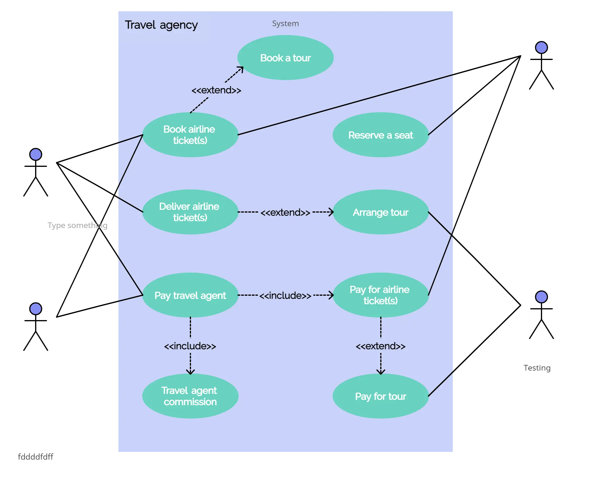

# Use Case Diagrams

## Definition

A **use case diagram** shows the **interactions between users (actors)** and a **system**.  
It does not show how the system works, but what it allows users to do.

---

## Basic Elements

| Element               | UML Symbol         | Technical Description                                                             |
|-----------------------|--------------------|------------------------------------------------------------------------------------|
| **Actor**             | 👤 (stickman)       | User or external system interacting with the system                               |
| **Use Case**          | ⭕ (oval)           | Function offered by the system                                                    |
| **System**            | ▭ (rectangle)      | Container of use cases                                                            |
| **Association**       | ➖ (line)           | Link between actor and use case                                                   |
| **Include**           | `<<include>>`       | A **required** action automatically included in another                           |
| **Extend**            | `<<extend>>`        | An **optional** action triggered under special conditions                         |

---

### Actors
- **User**: can register, log in, send and read a message  
- **Admin**: can log in, manage users, view logs

---

## 🔸 Use Cases

| Use Case                       | Involved Actor   | Notes                                              |
|-------------------------------|------------------|----------------------------------------------------|
| Register                      | User             |                                                    |
| Log in                        | User, Admin      | Used by both                                      |
| Send a message                | User             |                                                    |
| Read a message                | User             |                                                    |
| Manage users                  | Admin            | May include *Search for a user*                   |
| Search for a user             | Admin            | `<<include>>` in *Manage users*                   |
| View system logs              | Admin            | `<<extend>>` of *Manage users* (optional)         |

---

## Real Example: Kékés Voyages Reservation App

